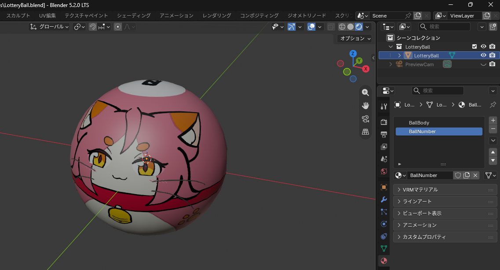
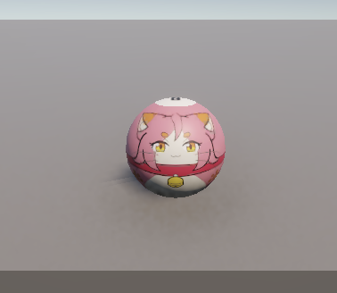

# LotteryBallKit

[](https://creativecommons.org/licenses/by/4.0/)

番号ボール（抽選機・ガチャ・ビンゴ用の物理ボール）を、どのUnityプロジェクトへも持ち込めるようにした移植キット。
番号は 0〜99 をアトラスのUVオフセットで切り替え、本体はキャラクター絵にも差し替えられます。

A drop-in Unity kit for numbered lottery balls (bingo / gacha / raffle machines).
Numbers 0–99 are switched by an atlas UV offset; the ball body can be swapped for a character texture.

<p align="center">
  
  
</p>

> 原典 / Origin: [RouletteSphereChaser](https://github.com/radiann-kswg/RouletteSphereChaser) の抽選ボールを単体アセットとして切り出したもの。

---

## 動作要件 / Requirements

| | |
| --- | --- |
| Unity | **6000.6.0f1**（Unity 6 系。6000.x なら概ね動作） |
| Render Pipeline | **URP 17.5.0**（`_BaseMap` / `_BaseColor` 前提） |
| 必須パッケージ | `com.unity.render-pipelines.universal` |

Built-in RP でも使えますが、`NumberBall.cs` のシェーダープロパティ名を
`_BaseMap` → `_MainTex`、`_BaseColor` → `_Color`、`_BaseMap_ST` → `_MainTex_ST` に読み替えてください。

Built-in RP works too, but rename the shader properties in `NumberBall.cs` as above.

---

## 導入方法 / Installation

### A. フォルダをコピー（推奨・確実） / Copy the folder

`Assets/LotteryBallKit/` を丸ごと、導入先プロジェクトの `Assets/` 以下へコピーするだけです。
`.meta` ファイルも一緒にコピーすると GUID が維持され、プレハブ参照が壊れません。

Copy the whole `Assets/LotteryBallKit/` folder into your project's `Assets/`.
Copy the `.meta` files as well so GUIDs — and therefore prefab references — survive.

### B. UPM パッケージとして参照 / As a UPM package

`Packages/manifest.json` に以下を追加します。

```json
"net.numbertales-radiann.lotteryballkit": "https://github.com/radiann-kswg/LotteryBallKit.git?path=Assets/LotteryBallKit"
```

または Package Manager の **＋ → Install package from git URL...** に上記URLを貼り付けます。
タグを固定する場合は末尾に `#v1.0.0` のように付けてください。

Or use **Package Manager → ＋ → Install package from git URL...**. Append `#v1.0.0` to pin a tag.

> UPM 経由で入れたパッケージは読み取り専用です。マテリアルやプレハブを改変したい場合は A のコピー方式を使ってください。
> UPM packages are immutable — use method A if you want to edit the materials or prefab.

### C. リポジトリをそのまま開く / Open this repository

このリポジトリ自体が動くUnityプロジェクトです。`Assets/LotteryBallKit/Scenes/SampleScene.unity` に動作サンプルが入っています。

This repository is itself a runnable Unity project; see `Assets/LotteryBallKit/Scenes/SampleScene.unity`.

---

## 使い方 / Usage

```csharp
var ball = Instantiate(numberBallPrefab).GetComponent<NumberBall>();
ball.number = 42;          // 0–99
ball.Apply();              // アトラスUVオフセットへ反映 / push to the atlas UV offset
ball.SetCharacterTexture(myTexture);  // 本体をキャラ絵に / swap the body texture
ball.SetCharacterTexture(null);       // 白ボールへ戻す / back to the plain white ball
```

1. `Prefabs/NumberBall.prefab` をシーンに配置（径 0.1m・Rigidbody CCD・SphereCollider 付き）
2. Inspector の `Number` で番号を設定（`OnValidate` から `Apply()` が走ります）
3. キャラ絵にするなら `SetCharacterTexture(tex)` を呼ぶ

番号の反映は `MaterialPropertyBlock` 経由なので、マテリアル資産は汚れません。
その代わりエディタの非プレイ描画では反映されないビューがあります（プレイ時は正常）。

Numbers are applied through a `MaterialPropertyBlock`, so the material assets stay clean —
at the cost of some editor views not previewing the change until you enter play mode.

詳細なAPIとスキンの描き方は [`Assets/LotteryBallKit/README.md`](Assets/LotteryBallKit/README.md) を参照してください。
See [`Assets/LotteryBallKit/README.md`](Assets/LotteryBallKit/README.md) for the full API and the skin-authoring guide.

---

## 収録物 / Contents

```
Assets/LotteryBallKit/
├── Prefabs/NumberBall.prefab      物理ボール本体 / the physics ball
├── Models/LotteryBall.fbx         球体メッシュ＋番号デカールディスク
├── Materials/                     URP Lit マテリアル 2種（本体 / 番号）
├── Textures/
│   ├── NumberAtlas.png            0〜99 の 10×10 アトラス
│   ├── BallSkins_Sample.png       サンプルスキン / sample skin
│   └── BallUV_Template.png        スキン作画用UVガイド / UV guide for skin authors
├── Scripts/NumberBall.cs          番号・テクスチャ制御 / number & texture control
├── Sources/                       Blender原本(.blend.bytes)・アトラス生成スクリプト
└── README.md / LICENSE.md

BlenderSources/                    編集用の原本一式（Unityの管轄外 / outside Unity's import path）
```

`BlenderSources/` は Unity にインポートさせないための置き場です。同じ内容の Blender 原本が
`Assets/LotteryBallKit/Sources/LotteryBall.blend.bytes` にも入っています（拡張子を `.blend` に戻すと開けます）。

`BlenderSources/` keeps the editable originals out of Unity's asset pipeline. The same `.blend`
also ships inside the package as `.blend.bytes` — rename it back to `.blend` to open it.

---

## 改造・再生成 / Modifying & regenerating

Blender原本の編集、番号アトラスの再生成、スキンの描き方の規約は
[`CONTRIBUTING.md`](CONTRIBUTING.md) にまとめています。

See [`CONTRIBUTING.md`](CONTRIBUTING.md) for editing the Blender source, regenerating the number
atlas, and the skin-authoring conventions.

---

## ライセンス / License

**CC BY 4.0** — 本リポジトリの収録物はすべて対象です（Blender原本・モデル・テクスチャ・サンプルスキン・スクリプト・サンプルシーンを含む）。
Everything in this repository is covered, including the Blender source, models, textures, the sample skin, scripts and the sample scene.

クレジット表記例 / Attribution:

```
LotteryBallKit by RadianN_kswg / ラジアン（柏木主税） — CC BY 4.0
```

番号アトラスの書体は同作者の PenchantManufacture image assets（CC BY 4.0）由来です。
番号テクスチャをそのまま再配布する場合は、あわせて次のクレジットを添えてください。

The number atlas typeface derives from the same author's PenchantManufacture image assets (CC BY 4.0).
If you redistribute the number texture as-is, please also credit:

```
PenchantManufacture image assets by RadianN_kswg / ラジアン（柏木主税） CC BY 4.0
```

全文 / Full text: [`LICENSE`](LICENSE) ・ https://creativecommons.org/licenses/by/4.0/
